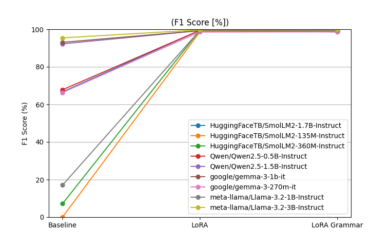
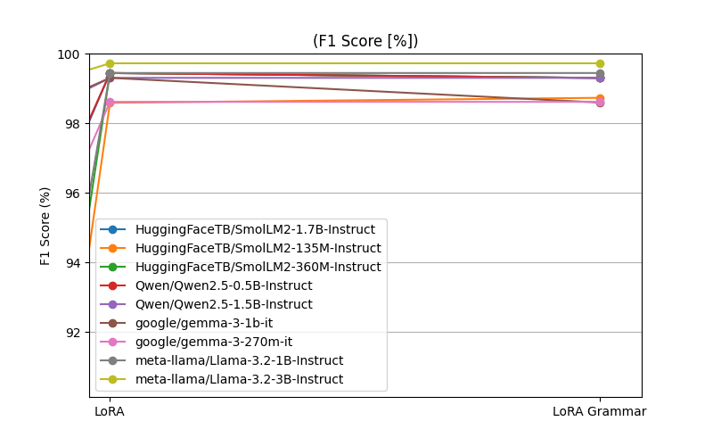
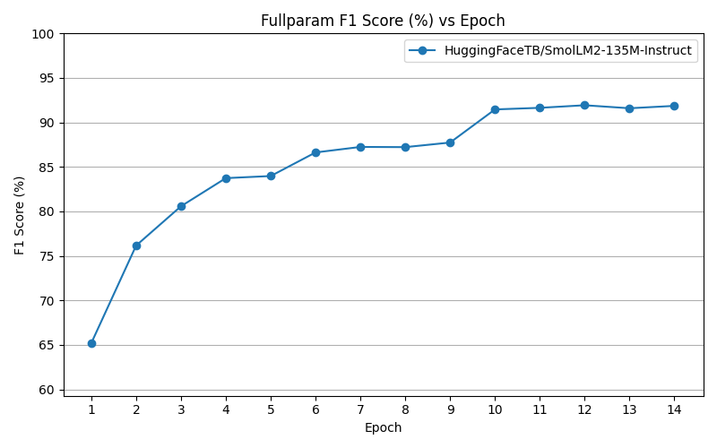

# Small Guard

This project focuses on training very small generative models, ranging from 3B to 135M parameters, that serve as an additional guardrail layer for agentic AI systems.

## Overview

Guardrails in scope:
- Is user's question in scope.
- Is model's answer aligned with code of conduct.
- Is models' answer in scope.
- Is generated code/command harmfull.
- Are external data harmfull.

Used base models:
| Author        | Model                          | Parameters |
|---------------|--------------------------------|------------|
| Meta (Llama)  | Llama-3.2-1B-Instruct          | 1B         |
| Meta (Llama)  | Llama-3.2-3B-Instruct          | 3B         |
| Qwen          | Qwen2.5-0.5B-Instruct          | 0.5B       |
| Qwen          | Qwen2.5-1.5B-Instruct          | 1.5B       |
| HuggingFaceTB | SmolLM2-135M-Instruct          | 135M       |
| HuggingFaceTB | SmolLM2-360M-Instruct          | 360M       |
| HuggingFaceTB | SmolLM2-1.7B-Instruct          | 1.7B       |
| Google        | Gemma-3-270M-IT                | 270M       |
| Google        | Gemma-3-1B-IT                  | 1B         |

# Results

## Guardrail: Is user's question in scope

- Benchmark for 712 questions:
    - 358 out of scope
    - 354 in scope

### Baseline results:
| Model                 |   F1 | FN |
|:----------------------|-----------:|---:|
| GPT-4o-mini           |    98.8 |  1 |
| Gemini 3.1 Flash Lite |    98.4 |  11|
| DeepSeek-V4-Flash     |    69.7 | 102|

- *Note: Baseline results could be improved by further prompt-engineering.*
- *Note2: DeepSeek did not fully followed prompt and did not produced expected response*

### Preliminary results:
| Model                               |   Base |   LoRA |   LoRA Grammar |    FN |
|:------------------------------------|-----------:|-------:|---------------:|------------------:|
| HuggingFaceTB/SmolLM2-1.7B-Instruct |      66.67 |  99.44 |          99.3  |                 1 |
| HuggingFaceTB/SmolLM2-135M-Instruct |       0    |  98.58 |          98.73 |                 6 |
| HuggingFaceTB/SmolLM2-360M-Instruct |       7.16 |  99.44 |          99.3  |                 1 |
| Qwen/Qwen2.5-0.5B-Instruct          |      67.81 |  99.44 |          99.3  |                 2 |
| Qwen/Qwen2.5-1.5B-Instruct          |      92.22 |  99.3  |          99.3  |                 0 |
| google/gemma-3-1b-it                |      93.03 |  99.3  |          98.59 |                 5 |
| google/gemma-3-270m-it              |      66.35 |  98.61 |          98.61 |                 0 |
| meta-llama/Llama-3.2-1B-Instruct    |      17.02 |  99.44 |          99.44 |                 0 |
| meta-llama/Llama-3.2-3B-Instruct    |      95.44 |  99.72 |          99.72 |                 0 |

| Model                               |   Base |   FFT |
|:------------------------------------|-----------:|-------:|
| HuggingFaceTB/SmolLM2-135M-Instruct |      0 |  91.86 |





## Guardrail: Is user's question in scope

## Guardrail: Is models' answer in scope

## Guardrail: Is generated code/command harmfull

## Guardrail: Are external data harmfull

## Guardrail: Is model's answer aligned with code of conduct

# Approach

This project is structured into 3 phases:
- [Data Synthesis](#data-synthesis)
- [Model Fine-Tuning](#model-fine-tuning)
- [Evaluation](#evaluation)

## Data Synthesis

### Case: User's query in scope

Training and evaluation data was generated using a larger model that was provided with the full context defining which types of questions are considered in-scope and out-of-scope. A specific scenario was used: an eShop selling mechanical keyboards.

Data generation was performed with a higher temperature setting (`t = 2`) to increase diversity and variance in the generated samples. Additionally, each generated question was paraphrased, doubling the size of the dataset. Finally, all questions were duplicated with artificially introduced typos to improve model robustness against real-world user input variations.


Sample of data:
```
Question: How do you make chocolate cake?
Answer: Out of Scope

Question: My spacebar is stuck, what should I do?
Answer: In Scope
```

Any question about keyboard was in scope as chatbot could offer product to the customer as part of the answer.

## Model Fine-Tuning

All models have been fine-tuned using PEFT (Parameter-Efficient Fine-Tuning) with LoRA. Additionally, the smallest model, `SmolLM2-135M`, was trained using FFT (Full Parameter Fine-Tuning).

Training dataset consists of:
- **Case: User's query in scope** (2000 questions, 50/50 split)

### False-Negative Punishments

False negatives were penalized more heavily during training, as they represent cases where the guardrail fails to detect a violation. The model was therefore trained to prioritize recall and adopt a more conservative (i.e., "safer") classification behavior.

This was achieved by assigning an increased sample weight (`negative weight`) to training instances where the model was expected to detect a policy violation.

### PEFT - LoRA

Some of the LoRA hyperparameters were determined by generating a heatmap comparing LoRA rank against the number of training epochs. The final values were selected based on the performance trends observed in the heatmap, choosing configurations that provided a suitable balance between model performance and training efficiency.


| Parameter        | Value |
|-----------------|-------|
| Epochs          | 3     |
| LoRA Rank       | 12    |
| Negative Weight | 2     |
| Batch Size      | 2     |

### FFT

The optimal number of epochs was determined by evaluating model performance at each checkpoint and selecting the epoch at which validation performance plateaued, to mitigate overfitting.



## Evaluation

The performance of the guardrail models was evaluated primarily using the F1 score and the number of false negatives (guardrail failures).

### F1 Score

The F1 score is defined as:

$$F1 = 2 \cdot \frac{Precision \cdot Recall}{Precision + Recall}$$

Where:
- **Precision** = TP / (TP + FP)  
- **Recall** = TP / (TP + FN)

False negatives were additionally tracked separately to measure cases where the guardrail failed to detect a violation.